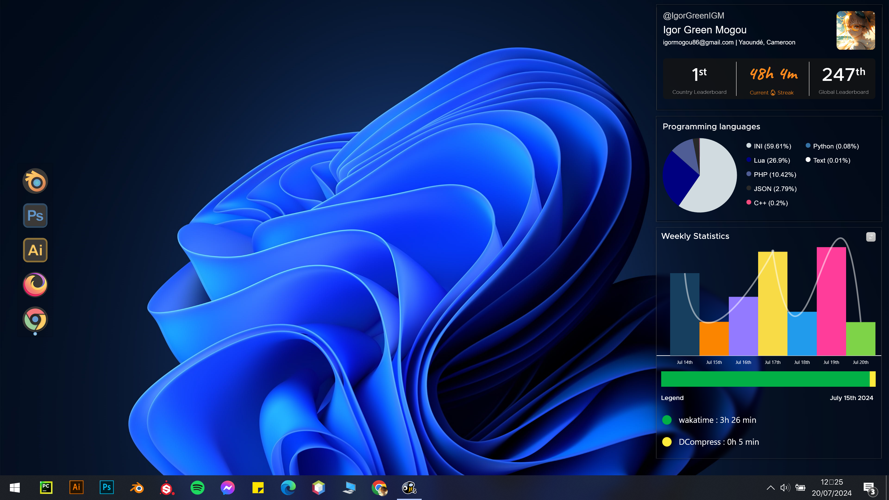
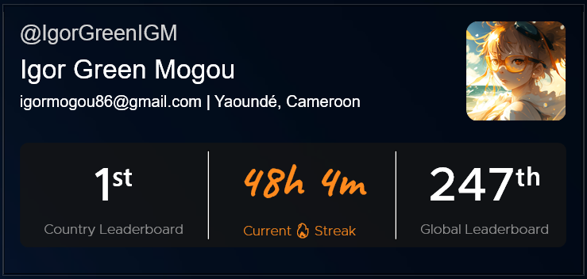
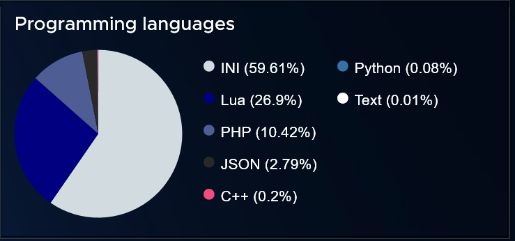
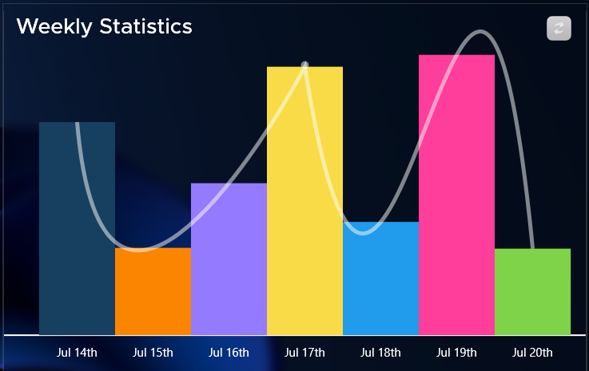
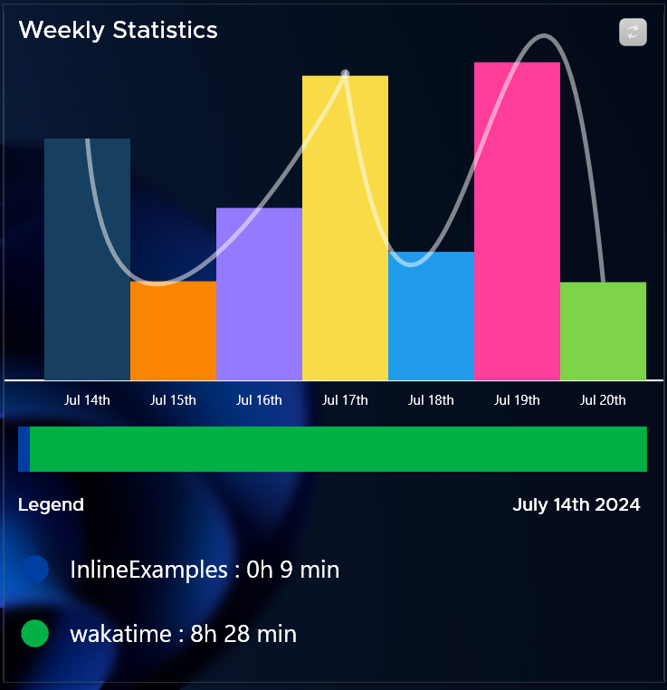
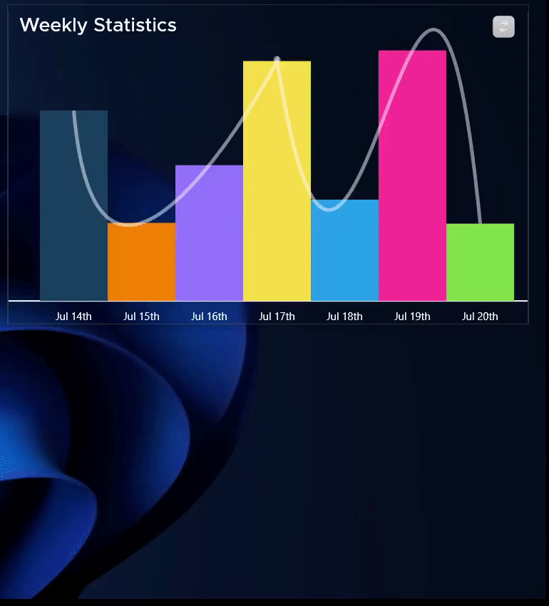

# Wakatime Rainmeter Skin

A Rainmeter skin that fetches your wakatime coding stats in real-time and displays them on your desktop.

## Features
The skin includes charts and layouts that primarily provide:
- **Daily Statistics**: Monitor your daily coding time and compare it with previous days.
- **7-Day Overview**: Visualize your coding activity over the past week.
- **Leaderboard Ranking**: Realtime display your rank onto the Your Country and the Global Wakatime leaderboard
- **Projects Breakdown**: Display your time allocation across various projects in the passed 07 days.
- **Programming Languages Breakdown**: Display the distribution of your coding time across different programming languages over the passsed seven days

## Installation
1. **Download Rainmeter**: [Download](https://www.rainmeter.net/) and install the lastest version of Rainmeter if you doesn't already have it.
2. **Download the Skin**: [Download the latest version](https://github.com/IgorGreenIGM/rainmeter-wakatime/releases) of the Skin.
3. **Install the Skin**: Double-click the `.rmskin` file to install the skin.
4. **Enter Your WakaTime API Key**: 
    - Get your [wakatime api key](https://wakatime.com/settings/api-key)
   - Paste your api key in the `API KEY` section in the skin settings layout (Make sure to press enter after pasting your api key) and validate.

## Screenshots
### Overview

### Layouts
| *Realtime Leadreboard*        | *Programming languages* | *Weekly statistics* |
|:----------------------:|:----------------------:|:----------------------:|
|  |  |  |

| *Projects Statistics*        | *Demo* |
|:----------------------:|:----------------------:|
|  |  |

## Contributing
We welcome contributions to enhance this Rainmeter skin. If you have suggestions, improvements, or bug fixes, please follow these steps:
1. Fork the repository on GitHub.
2. Create a new branch for your changes.
3. Commit your changes with clear and descriptive messages.
4. Push your changes to your forked repository.
5. Open a pull request to merge your changes into the main repository.

## Acknowledgements
- [Rainmeter](https://www.rainmeter.net/) for providing a powerful desktop customization tool.
- [WakaTime](https://wakatime.com/) for providing an excellent coding activity tracking service.
- [json-lua](https://github.com/tiye/json-lua) An awesome light JSON library for lua.
- [FrostedGlass](https://github.com/TheAzack9/FrostedGlass) by [TheAzack9](https://github.com/) A Rainmeter plugin for blured background.

## License
This project is licensed under the [Creative Commons Attribution-NonCommercial 4.0 International License (CC BY-NC 4.0)](https://creativecommons.org/licenses/by-nc/4.0/). You are free to use, modify, and share the skin for non-commercial purposes, provided that you give appropriate credit to the original author. 
See [LICENSE.md](License.md)